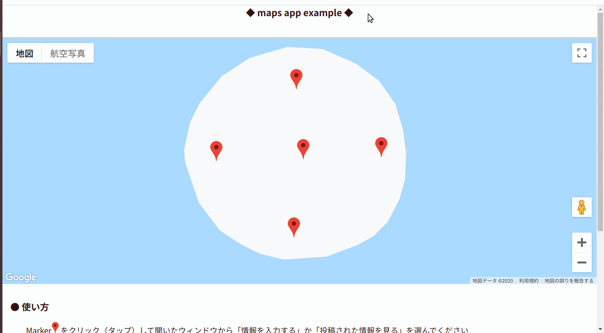

# App that can post the sales status of items from local shops　　

---　　


  

NOTE   
_I can not speak English.  
This sentence was created entirely by machine translation._  


## What is useful?  

You don't want to go shopping without knowing that the product is sold out, right?

## description  

Display local store information **on Google Maps** so that shoppers at that store can post out-of-stock information so that others don't have to waste time.

Here I mainly deal with out-of-stock information of drug stores and supermarkets (effect of COVID-19), but you can also use it for other purposes. (For example, information on the shortage of relief supplies during a disaster)  


## local environment  
```  
~$ cat /etc/os-release

NAME="Ubuntu"
VERSION="18.04.4 LTS (Bionic Beaver)"
...
...

~$ flask --version  

Python 3.6.9
Flask 1.1.1
Werkzeug 1.0.0

~$ psql --version

psql (PostgreSQL) 11.7 (Ubuntu 11.7-2.pgdg18.04+1)
```  

I am running something created in this environment on "**Microsoft Azure**," App Service on Linux ". 　

## Usage  

_Create and configure the database and enter the necessary information in `config.py`._

:one: **Enter information in `data.py` of `instance` directory.**

| key | description |
| --- | --- |
|"code" | Required to identify store information. It can be in any format as long as it is unique. |
| "lat", "lng" | Use to display "marker" indicating store location on Google map. |  

Others can be changed according to what you want to show the user.  


```
DATA = [
        # 1
        {"code": "0001",
         "update": " - ",
         "shopname": "<shop name>",
         "open": "<open time>",
         "address": "<shop address>",
         "lat": 35.2292387,
         "lng": 136.9336472,
         "tel": "<telephone number>",
         },
        # 2
        {"code": "0002",
         "update": " - ",
         "shopname": "<shop name>",
         "open": "<open time>",
         "address": "<shop address>",
         "lat": 35.2292387,
         "lng": 136.9336472,
         "tel": "<telephone number>",
         },
         ...
         ...
         ..
        ]

```

:two: **Execute `setup.py` from the command line and perform the required processing**  

```
~$ python3 setup.py create
```  

| argument | description|
| --- | --- |
| "create" | Create three tables "shopinfo", "postdata" and "opinions" on the database to use.|
| "insert" | Insert the information described in `data.py` into the table "shopinfo".　|
| "makejson" | Create a "data.json" file that describes the location information required to draw the marker on the google map and the contents to be displayed in the "information window" opened by clicking the marker.|

### others  
- db_record_delete.py : Use when deleting a table  

```
~$ python3 db_record_delete.py 3 post
```  

| argv | description |
| --- |---|
| argv[1] | number: delete record number |
| argv[2] | table name: "post" or "opinion" |  

- res_update.py: reply to opinions

```
~$ python3 res_update.py 4 "Hello world"
```  

| argv | description |
| --- |---|
| argv[1] | number: opinions number |
| argv[2] | text: reply text |  


## References

- Google Maps API: [Maps Javascript API](https://developers.google.com/maps/documentation/javascript/tutorial?hl=ja)
- Flask: [User's Guide](https://flask.palletsprojects.com/en/1.1.x/)
